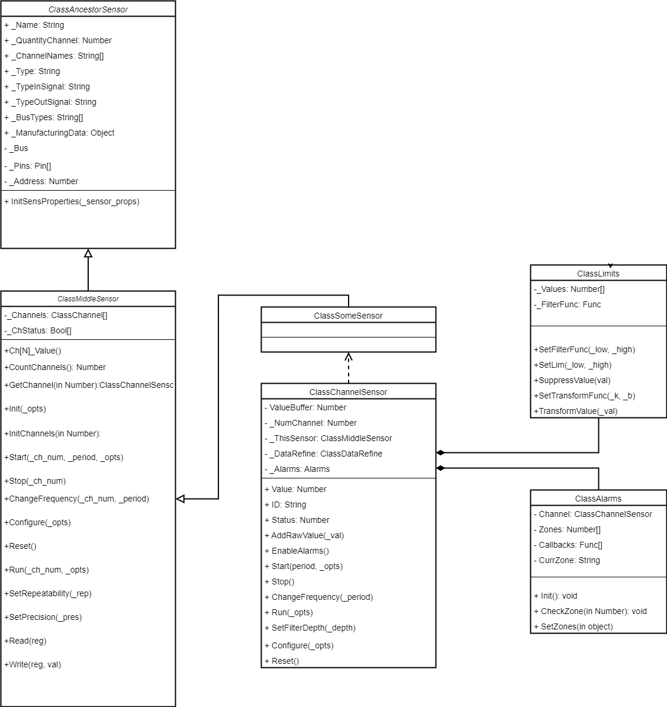
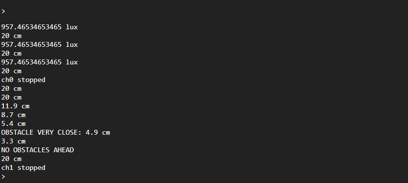
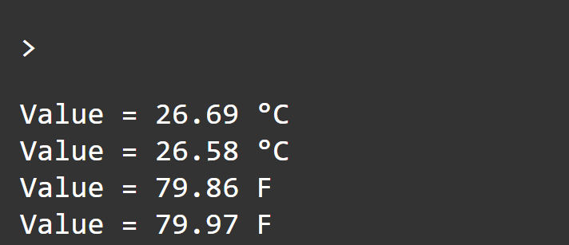

<div style = "font-family: 'Open Sans', sans-serif; font-size: 16px">

# ModuleSensor
<div style = "color: #555">
    <p align="center">
    
    </p>
</div>

## Лицензия
////

### Описание
<div style = "color: #555">

Модуль Sensor предназначен для обеспечения разработчиков функционалом для удобной и эффективной работы с датчиками в рамках фреймворка EcoLight. 
Наделяет датчики полями и методами, которые покрывают типовые задачи идентификации, управления и считывания данных. Для этого модуль создает унифицированный интерфейс, разделяя объект датчика на измерительные каналы. 
Каждый канал представляет собой отдельную измеряемую датчиком величину и функционал, относящийся к считыванию и обработке этой величины.
Данный подход обеспечивает единообразное взаимодействие с различными типами датчиков, упрощая процесс учета, сбора данных, делегирования команд, а так же сокращая время разработки новых модулей под конкретные модели датчиков. 

Заложенный в модуль функционал включает в себя поэтапную автоматическую обработку значений измерений датчика, что повышает надежность и удобство работы. Этот процесс включает в себя следующие этапы:
- Супрессия: выходные данные подвергаются ограничению с использованием ограничительных функций. Это обеспечивает то, что значения с датчика находятся в заданных пределах, что позволяет учесть границы работы датчика или предотвратить определенные ошибки; 
- Трансформация линейной функцией: в случаях, когда значения с датчика требуют преобразования (например, для корректировки либо перевода значений в другие единицы измерения), применяется линейная функция. Эта функция корректирует значения согласно коэффициентам, которые задает пользователь;
- Фильтрация: для снижения влияния шумов и искажений на измерения применяется фильтрация данных. Этот этап помогает получить стабильные и плавные данные от датчиков;
- Проверка зоны измерений: значения с датчика сверяются с зонами измерений, настраиваемые пользователем. Если значение выходит за пределы заданных зон, это активировать соответствующие реакции в виде коллбэков.

Больше об обработке данных в соответствующем [разделе](./README_DATA_REFINE.md#методы). 

Набор классов, обеспечивающих функционал датчика делитcя на такие части: 
- Основная, которая состоит из:
    - ветки классов [ClassAncestorSensor](./README_ANCESTOR.md) и [ClassMiddleSensor](./README_MIDDLE.md), хранящих в себе поля и методы, общих для всех датчиков;
    - класса [ClassChannelSensor](README_CHANNEL.md), который представляет собой интерфейс для работы с отдельным каналом датичка;
- Сервисная: 
    - [ClassDataRefine](./README_DATA_REFINE.md) реализует математико-логический аппарат для обработки и корректировки поступаемых значений;
    - [ClassAlarms](./README_ALARMS.md) добавляет поддержку зон измерения и алармов;  
- Прикладная - класс, отвечающий за отдельно взятый канал датчика. Этот класс реализуется вне данного стека наследованием от **ClassMiddleSensor** и реализацией его интерфейсов.

<div align='left'>
    
</div>

</div>

### Примеры
#### Опрос двухканального датчика с использованием сервисных функций
<div style = "color: #555">

```js
//Импорт зависимостей
const ClassAppError     = require('ModuleAppError');
    require('ModuleAppMath').is();
const ClassMiddleSensor = require('ModuleSensor');
const ClassVL6180       = require('ModuleVL6180');
const ClassI2C          = require('ModuleI2CBus');

const I2Cbus = new ClassI2C();
const bus = I2Cbus.AddBus({sda: B15, scl: B14, bitrate: 100000 }).IDbus;

const _opts = {
    bus: bus,           //объект шины
    pins: [B14, B15],   //массив используемых пинов 
    address: 0x29       //адрес на шине
}
//Аргументы для инициализации объекта датчика
const sensor_props = ({
    name: "VL6180",                     
    type: "sensor",       
    quantityChannel: 2,
    channelNames: ['light', 'range'],
    typeInSignal: "analog",            
    typeOutSignal: "digital",           
    busTypes: ["i2c"],                
    manufacturingData: {
        IDManufacturing: [                  //о производителе
            { "Adafruit": "4328435534" }    //прозводитель: артикул
        ],
        IDsupplier: [                       //о поставщике
            { "Adafruit": "4328435534" }    
        ],
        HelpSens: "Proximity sensor"        //о самом датичке
    }
});

//Создание объекта класса
//*VL610 - класс, который наследуется от ClassMiddleSensor *
let vl6180 = new VL6180(opts, sensor_props);

//Сохранение ссылок на каналы в переменные
/* Далее все взаимодействие с датчиком выполняется через эти каналы */
const ch0 = vl6180.GetChannel(0);
const ch1 = vl6180.GetChannel(1);

//Установка для 1-го канала корректирующей функции f(x) = 0.1 * x 
//для преобразования итогового значения в см из мм.
ch1._DataRefine.SetTransmissionOut(0.1, 0);
//Установка для 1-го канала ограничителей в 0.5 и 20 см
ch0._DataRefine.SupressOutValue(0.5, 20);
//Установка глубины фильтрации для 0-го канала
ch1._DataRefine.SetLim(0.5, 20);
//Установка глубины фильтрации для 0-го канала
ch0.SetFilterDepth(5);

ch1._Alarms.SetZones({
    red: {
        low:    5, 
        high:   19,
        cbLow:  (ch) => { console.log(`AN OBSTACLE IS VERY CLOSE: ${ch.Value} cm`); }, 
        cbHigh: (ch) => {  console.log(`NO OBSTACLE AHEAD`); }
    },
    green: {
        cb: (ch) =>     { console.log(`AN OBSTACLE IS CLOSE: ${ch.Value}`); }
    }
});

// Запуск опроса обоих канала
ch0.Start();
ch1.Start();

//Вывод показаний с датчика раз в 1 сек.
let interv = setInterval(() => {
    if (ch0.IsUsed)
        console.log(`${(ch0.Value).toFixed(1)} lux`);
    if (ch1.IsUsed)
        console.log(`${(ch1.Value).toFixed(1)}  cm`);
}, 1000);

//Прекращение опроса 0-го канала через 5 сек.
setTimeout(() => {
    ch0.Stop();
    console.log("ch0 stopped");
}, 3000);
//Прекращение опроса 1-го канала через 10 сек.
setTimeout(() => {
    ch1.Stop();
    console.log("ch1 stopped");
    clearInterval(interv);
}, 10000);
```

#### Результат выполнения:

<div align='left'>
    
</div>

#### Смена единицы измерения температуры на ходу с помощью настройки линейной функции:
```js
//Инициализация канала, измеряющего температуру в °C 
const temprtCh = meteoSensor.GetChannel(num);

//Запуск и вывод показаний
temprtCh.Start();
let post = '°C';
setInterval(() => {
    console.log(`Value = ${(temprtCh.Value).toFixed(2)} ${post}`);
}, 2000);

setTimeout(() => {
    //Настройка перевода значений в Фаренгейты
    temprtCh._DataRefine.SetTransmissionOut(1.8, 32);
    post = 'F';
}, 4000);

```
#### Результат выполнения:

<div align='left'>
    
</div>

</div>

### Зависимости
<div style = "color: #555">

- <mark style="background-color: lightblue">[ClassAppError](https://github.com/Konkery/ModuleAppError/blob/main/README.md)</mark>
</div>

</div>
    